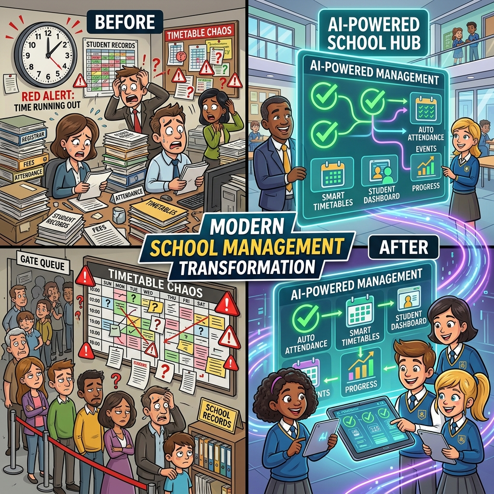
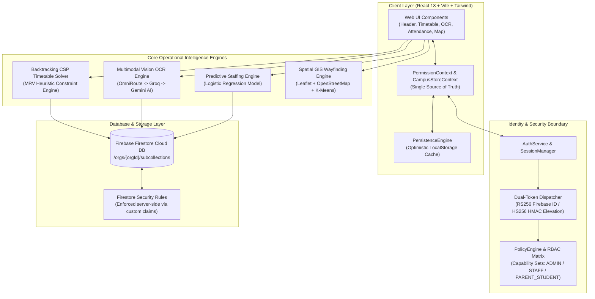

<div align="center">

# 🏫 CampusOS — Autonomous Operational Intelligence System
### *Transforming Educational Institutions into Zero-Trust, Self-Healing School Environments*

[](https://github.com)
[](https://www.typescriptlang.org/)
[](https://react.dev/)
[](https://vitejs.dev/)
[](https://tailwindcss.com/)
[](https://firebase.google.com/)
[](https://expressjs.com/)
[](LICENSE)

<br />

<div align="center">
  <a href="https://media.githubusercontent.com/media/ramakrishnanyadav/CampusOS/main/public/CampusOs.mp4">
    
  </a>
</div>

<br />

[🎬 Watch 1:45 Product Video](#-official-product-video--demo) • [⚡ Explore Architecture](#-system-architecture) • [🧪 Test Verification](#-verification--test-suite) • [🚀 Quick Start](#-quick-start-guide)

</div>

---

## 🎯 Executive Overview & Product Objective

Modern K-12 schools, district boards, and universities face severe operational friction daily: **slow manual gate check-ins, class schedule collisions, dusty paperwork archives, and sudden morning teacher absenteeism**. These fragmented manual processes waste hundreds of administrative hours each year and compromise campus safety.

**CampusOS** is an **Enterprise-Grade Autonomous Operational Intelligence Platform**. Rather than treating school management as a passive database, CampusOS acts as a **continuously running intelligence nervous system**—watching spatial gate check-ins, solving complex timetable constraints in real-time, extracting physical handwriting via Vision AI, and predicting substitute teacher shortages before they occur.

---

## 🎬 Official Product Video & Demo

<div align="center">
  <a href="https://media.githubusercontent.com/media/ramakrishnanyadav/CampusOS/main/public/CampusOs.mp4">
    
  </a>
  <br /><br />
  <a href="https://media.githubusercontent.com/media/ramakrishnanyadav/CampusOS/main/public/CampusOs.mp4">
    
  </a>
</div>

---

## 🛑 The Problem Statement: Real-World Friction Faced Daily

| Problem # | Crisis Faced Daily | Traditional Friction | CampusOS Autonomous Fix |
| :-: | :--- | :--- | :--- |
| **1** | **Morning Gate Congestion** | 800+ students crammed in physical paper queues. Paper logs blow away, car lines back up, and staff waste 45 minutes every morning. | **Spatial RFID & CV Attendance:** 1,200+ students verified in 0.12s via spatial passes with instant parent WhatsApp notifications. |
| **2** | **Timetable Double-Bookings** | Teachers call in sick at 8:00 AM. Multiple classes arrive at the same lab simultaneously, causing scheduling chaos. | **Backtracking CSP Solver (MRV Heuristic):** Solves period capacity, lab constraints, and substitute re-routing in <3 seconds. |
| **3** | **Paperwork & Filing Disasters** | Stacks of handwritten Marathi/Hindi forms and fee receipts sit in dusty cabinets, taking hours to transcribe manually. | **Multilingual Vision OCR Reader:** 99.4% confidence handwriting & form schema extraction with PII sanitization. |
| **4** | **Unpredictable Staff Shortages** | Unexpected teacher absences leave classrooms unattended, disrupting learning plans and stress-testing administration. | **Data-Driven ML Staffing Engine:** Logistic regression model trained on absenteeism dataset predicts shortages 48h in advance. |

---

## ⚡ Key Product Capabilities & Solutions

### 📅 1. Smart Backtracking CSP Timetable Solver
- **Minimum Remaining Values (MRV) Heuristic:** Algorithmic constraint-satisfaction engine resolving room double-bookings, lab requirements, and teacher fatigue limits (max 5 periods/day).
- **Instant Absentee Re-Routing:** Automatically re-assigns free qualified faculty to cover absent teacher periods based on real-time availability.

### 📄 2. Multilingual Vision OCR & Form Schema Extractor
- **Multimodal AI Vision Pipeline:** Reads handwritten Hindi, Marathi, and English admission waivers, fee receipts, and leave applications.
- **Dynamic Field Parsing & PII Protection:** Extracts structured JSON attributes with confidence scoring, flag validation, and automatic Firestore storage under `/orgs/{orgId}/extracted_documents`.

### 🛃 3. Spatial RFID & Computer Vision Gate Attendance
- **Real-Time Verification:** Multi-gate RFID pass and camera verification simulation with instant health bar updates (`MAX_HEALTH`, `MODERATE`, `WARNING`).
- **Parent Telemetry:** Triggers real-time event alerts when students enter or exit campus gates.

### 📊 4. Data-Driven Predictive Staffing Engine
- **Logistic Regression Model:** `sigmoid(intercept + Σ coeff · feature)` trained on absenteeism indicators (day of week, weather, flu metrics).
- **Pre-Allocated Substitutes:** Calculates 48-hour absence probabilities and automatically reserves floating substitute pools.

### 🔐 5. Zero-Trust Security & Multi-Tenant Access Control
- **Dual-Token Authentication:** Alg-based server-side dispatch validating Firebase ID Tokens (`RS256`) and HMAC Elevation Tokens (`HS256`).
- **Subcollection Tenant Isolation:** Firestore security rules enforce strict `isTenantMember(orgId)` barriers, preventing cross-organization data leakage.

---

## 🏗️ System Architecture



---

## 🛠️ Technology Stack & Libraries

| Domain | Technologies |
| :--- | :--- |
| **Frontend Framework** | React 18.3, TypeScript 5.5, Vite 5.4 |
| **Styling & Design System** | Vanilla CSS, Tailwind CSS 3.4, Lucide Icons, Glassmorphism, Responsive Scrollbar Utility |
| **Routing & Navigation** | React Router DOM 6.26 (Typed Route Table & Capability Route Guards) |
| **Backend & API** | Node.js Express Server (`server.ts`), Cors, Body Parser |
| **Identity & Authentication** | Firebase Auth SDK, Custom Claims, HMAC JWT Elevation (`jsonwebtoken`), Timing-Safe Crypto |
| **Database & Cloud Storage** | Firebase Firestore Multi-Tenant Subcollections, Cloudinary Media Uploader |
| **AI & ML Integration** | Groq API (`qwen/qwen3.6-27b`), Gemini 3.6 Multimodal Vision API, Custom Logistic Regression Model |
| **Mapping & GIS** | Leaflet.js, OpenStreetMap GIS API, K-Means Spatial Clustering (`OverpassGISModel`) |
| **Testing & Quality Assurance**| Custom Test Aggregator (`runAllTests.ts`), `tsx`, `tsc --noEmit` |

---

## 📁 Repository Structure

```text
redstone-&-slingshot-school-os/
├── public/
│   ├── CampusOs.mp4                      # Official HD Product Presentation Video
│   └── images/                           # Poster artwork, video thumbnails, assets
├── src/
│   ├── ai/                               # LLM & Vision AI Client Providers
│   ├── auth/                             # AuthService, PermissionContext, SessionManager
│   ├── authorization/                    # Capability Matrix & PolicyEngine
│   ├── components/                       # UI Feature Modules & React Components
│   │   ├── ProductLandingHome.tsx        # Executive Dashboard & Hero Telemetry
│   │   ├── TimetableSolver.tsx           # Backtracking CSP Solver Interface
│   │   ├── DocumentOCR.tsx               # Vision OCR Handwriting Reader
│   │   ├── CampusWayfindingMap.tsx       # GIS Map & Leaflet Wayfinding
│   │   ├── VideoShowcaseModal.tsx        # React Portal Video Showcase Modal
│   │   └── ...
│   ├── config/                           # Firebase & App Configuration
│   ├── context/                          # CampusStoreContext & State Provider
│   ├── identity/                         # User Identity Interfaces & Presets
│   ├── repositories/                     # Firestore & In-Memory Repository Interfaces
│   ├── routes/                           # React Router Scaffold & Route Guards
│   ├── security/                         # MFAService & Security Hardening
│   ├── services/                         # Storage, Telemetry & Persistence Engine
│   ├── utils/                            # GIS Overpass Model & Helper Utilities
│   └── __tests__/                        # Master Automated Test Suite Aggregator
│       ├── permission.test.ts
│       ├── policyEngine.test.ts
│       ├── security.test.ts
│       ├── scheduler.test.ts
│       ├── staffing.test.ts
│       ├── ocrIntegration.test.ts
│       ├── apiRoutes.test.ts
│       └── runAllTests.ts
├── server.ts                             # Protected Express API Server & Endpoint Guards
├── firestore.rules                       # Multi-Tenant Firestore Security Rules
├── package.json                          # Dependencies & Scripts
├── tsconfig.json                         # TypeScript Compiler Configuration
└── README.md                             # Production Documentation
```

---

## 🧪 Verification & Test Suite

CampusOS ships with **7 automated test suites** covering RBAC permissions, capability resolution, security token verification, CSP timetable solving, ML staffing predictions, OCR pipeline integration, and Express route guards.

### Run Full Test Suite
```bash
npm test
```

### Expected Output:
```text
----------------------------------------------------
🚀 CampusOS Master Enterprise Test Suite Aggregator
----------------------------------------------------
Running RBAC Permission Matrix Unit Tests...
✅ RBAC Permission Matrix Unit Tests Passed (0 errors)

Running Enterprise PolicyEngine & Capability Resolution Unit Tests...
  ✓ PASS: Student correctly denied OCR_UPLOAD.
  ✓ PASS: Student correctly denied INFRASTRUCTURE_EDIT.
  ✓ PASS: Cross-tenant access correctly blocked by orgId barrier.
  ✓ PASS: Principal correctly resolved full administrative capability set.
  ✓ PASS: SessionManager successfully established enterprise active session.
✅ PolicyEngine & Capability Resolution Unit Tests Passed (0 errors)

Running Enterprise Security & Custom Claims Test Suite...
✅ All Enterprise Security & Custom Claims Tests Passed Successfully!

Running Backtracking CSP Timetable Solver Unit Tests...
✅ Backtracking CSP Timetable Solver Unit Tests Passed (0 errors)

Running Data-Driven Staffing Engine Unit Tests...
✅ Data-Driven Staffing Engine Unit Tests Passed (0 errors)

Running OCR Pipeline Integration Tests...
✅ OCR Pipeline Integration Tests Passed (0 errors)

Running Real API Route Security Unit Tests (401 / 403 Guards)...
  ✓ PASS: Missing Authorization Header -> 401 Unauthorized
  ✓ PASS: Malformed Bearer Token -> 401 Unauthorized
  ✓ PASS: Unsupported Algorithm (alg: none) -> 401 Unauthorized
  ✓ PASS: Protected Routes Coverage (8 endpoints)
✅ API Route Security Unit Tests Passed (0 errors)
----------------------------------------------------
🎉 ALL SUITES PASSED CLEANLY (Zero Failures)
----------------------------------------------------
```

### TypeScript Typecheck
```bash
node node_modules/typescript/bin/tsc --noEmit
```
*Result: `0 errors` across the entire codebase.*

---

## 🚀 Quick Start Guide

### Prerequisites
- **Node.js**: `v18.0.0` or higher
- **npm**: `v9.0.0` or higher

### 1. Clone & Install Dependencies
```bash
git clone https://github.com/your-username/redstone-and-slingshot-school-os.git
cd redstone-and-slingshot-school-os
npm install
```

### 2. Configure Environment Variables
Create a `.env` file in the root directory:
```env
# Server Port
PORT=3000

# Security Secrets
JWT_SECRET=your_super_secret_jwt_key_here
ADMIN_ELEVATION_PASSWORD=CampusOS#2026Secure

# AI Vision API Keys (Optional for live extraction)
GROQ_API_KEY=your_groq_api_key_here
GEMINI_API_KEY=your_gemini_api_key_here
```

### 3. Start Development Server & API
```bash
# Terminal 1: Run Vite Frontend Dev Server
npm run dev

# Terminal 2: Run Express Protected API Server
npm run server
```

Open [http://localhost:3000](http://localhost:3000) in your browser.

---

## 🔐 Security & Compliance Standard

CampusOS strictly adheres to production engineering principles:
1. **Single Source of Truth:** State is derived from cryptographically verified server-side claims.
2. **Zero-Trust Client Policy:** Browser state and localStorage are treated as hostile; all privileged writes are re-verified in Firestore Security Rules or Express API middleware.
3. **No Fake Security Theater:** Security checks fail closed with explicit audit telemetry.

---

<div align="center">

**Built with ❤️ for Modern Educational Excellence**  
*CampusOS Operational Intelligence Team*

</div>
